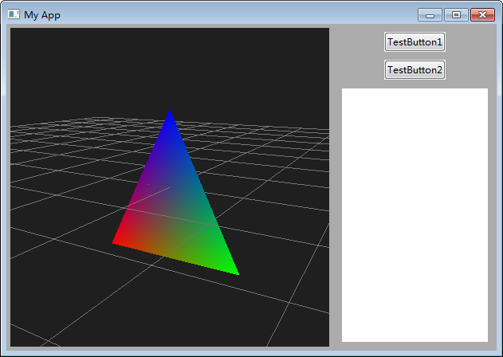

# A sample Magnum + wxWidgets C++ project

Those packages and tools are used to build this project.

- [mosra/magnum: Lightweight and modular C++11 graphics middleware for games and data visualization](https://github.com/mosra/magnum)

- [wxWidgets/wxWidgets: Cross-Platform GUI Library](https://github.com/wxWidgets/wxWidgets)

- [MSYS2](https://www.msys2.org/), this contains the compiler suite(mingw-w64 gcc compiler), and many prebuild libraries.

- [eranif/wx-config-msys2: wx-config tool for MSYS2 based installation of wxWidgets using the mingw64 repository](https://github.com/eranif/wx-config-msys2)

- [Code::Blocks IDE](https://www.codeblocks.org/), the `.cbp` file should be opened by this IDE.

# How to build

First, you have [MSYS2](https://www.msys2.org/) installed in your Windows.

The wxWidgets library could be installed by such commands in the msys2 shell.

~~~~
pacman -S mingw-w64-x86_64-wxmsw3.1
~~~~

And the Magnum library should also be installed by the commands

~~~~
pacman -S mingw-w64-x86_64-magnum
~~~~

In the root folder, there is a file named `wx-config-msys2.exe`, which I built from the project: [eranif/wx-config-msys2: wx-config tool for MSYS2 based installation of wxWidgets using the mingw64 repository](https://github.com/eranif/wx-config-msys2). The `wx-config-msys2.exe` will be called when you click the "Build" button in Code::Blocks to generate the correct build options.

The source code is mainly modified from this magnum example code:

https://github.com/mosra/magnum-examples/blob/master/src/mouseinteraction/MouseInteractionExample.cpp

Also, the wxWidgets code is modified and redesigned from magnum's wxWidgets bootstrap code:

https://github.com/mosra/magnum-bootstrap/tree/base-wxwidgets

# The result application

# The current issue

The mouse scroll event works OK(see `void GLPanel::OnMouseScroll(wxMouseEvent &event)` function), so when you scroll up/down with the mouse's wheel, you can zoom in/out the scene.

The key press handling works OK(see `void GLPanel::OnKeyDown(wxKeyEvent &event)` function), when you press the "0" key, the scene/camera will get reset, when you press the "1", "3" or "7" key, the scene/camera will go to the preset positions.

But it looks like the mouse left button drag does not rotate the scene correctly(see `void GLPanel::OnMouseMove(wxMouseEvent &event)` function), compared with Magnum's official webgl demos here: [Mouse In­ter­ac­tion Ex­am­ple](https://magnum.graphics/showcase/mouseinteraction/), also the right mouse button drag is not working, it should translate the screne/camera.

